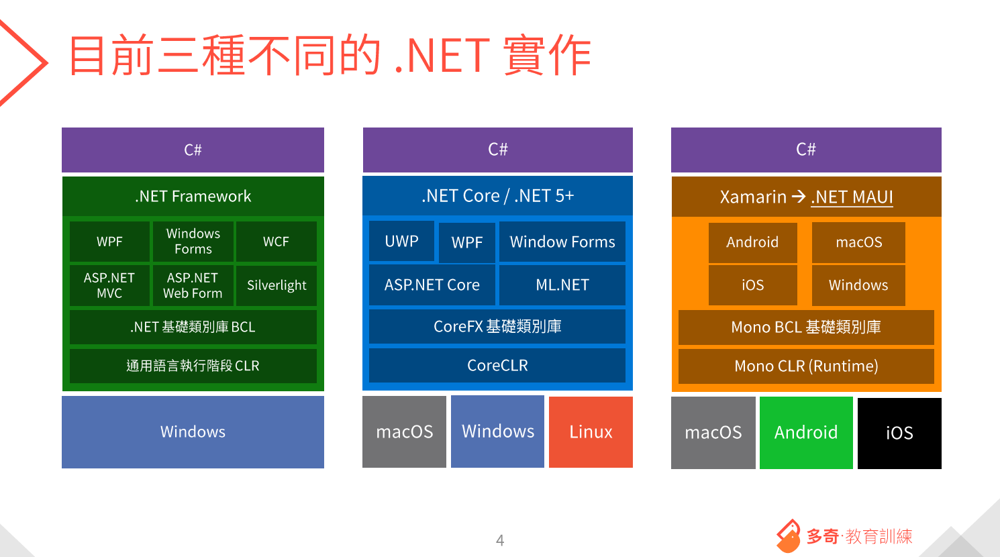
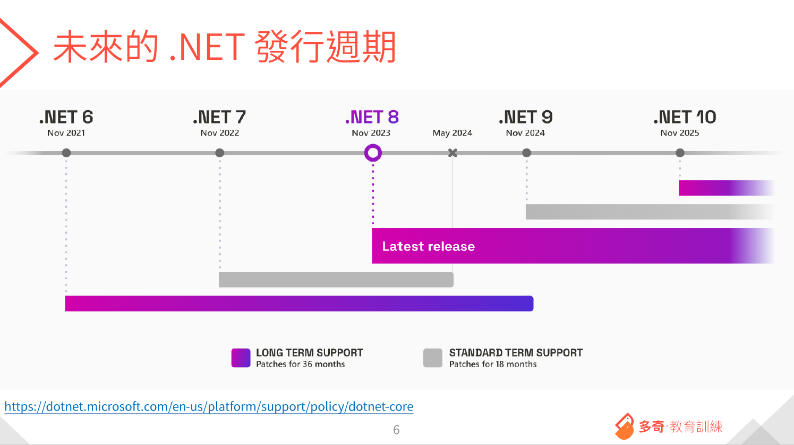

# .net 基礎知識
1. .net 有三種不同的實作

2. 發行週期

關於升級，保哥建議只要有新的版本，無論未來是 9 、10 、11
只要發行就是全升

對於支援度問題...

# .net Standard

.net core 剛推出的時候，為了能騙微軟的客戶升級到 1.0 (很難用)
於是做了一個設計： .net standard 的類別庫架構

這個架構最主要的目的是
**可以寫一份類別庫的專案，同時給 .net core 專案、.net framework 專案使用**

.net standard 的架構訂出來之後，微軟訂出一個政策：
我們的 api 只要寫進 .net core 的任何版本，例如說 1.0 版
那麼到下一版 1.1  甚至 2.0 ，api 是不會移掉的
就算未來沒在用，api 也會一直留存

一直到 .net 5 ,  微軟決定不再同時支援 .net framework 跟 .net Core
同時也把 core 字拿掉

而在現在 .net ， 只有在 asp.net core 會看到

換句話說
asp.net core 5 =  等同於 .net 5
asp.net core 6 =  等同於 .net 7
asp.net core 8 =  等同於 .net 8

# 問題：如果有一個套件 只支援 .net 3.1 ，那他能不能在 .net 8 使用？

# 關於升級

.net 升級小幫手

https://learn.microsoft.com/zh-tw/dotnet/core/porting/upgrade-assistant-overview