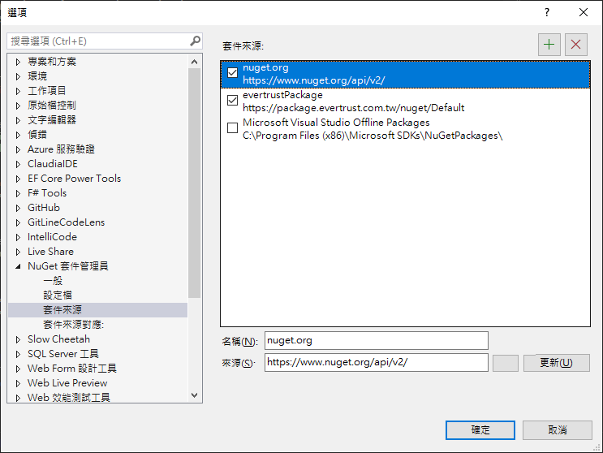

# 關於 nuget

## 發布 nuget 套件動作

1. 建立一個類別庫

在 csproj 檔案加上版號

```xml
<Version>1.0.0<Version>
```
1. 對專案按右鍵，點選套件
2. 產生專案的 .nupkg 就是那個套件本身


升級套件的作法
- 改完類別庫後，把 <Version>1.0.0<Version> 改成 其他數字
- 再執行一次上方操作


## 查詢 nuget 來源

```sh
dotnet nuget list source
```
```sh
dotnet nuget list source
已註冊的來源:
  1.  nuget.org [已啟用]
      https://api.nuget.org/v3/index.json
  2.  evertrustPackage [已啟用]
      https://package.evertrust.com.tw/nuget/Default
  3.  Microsoft Visual Studio Offline Packages [已啟用]
      C:\Program Files (x86)\Microsoft SDKs\NuGetPackages\
```


## 引入 nuget 來源的動作

### 全域管理 Nuget 套件


1. 到nuget 管理工具

2. 點選設定後的這個介面增加


這個檔案背後是在抓 nuget.json 檔案

檔案位置：
```sh
%AppData%\NuGet\NuGet.Config
```

雖然這樣就可以在本機取得不同來源的 nuget 套件，不過保哥建議：
一定要在專案本地放一個 nuget.config 檔案放進版控，不要改 global 的 Sourse 

## 比較好的做法：依據專案管理 nuget 套件
1. 手動新增 nuget.config 檔案到 .git 同層目錄
2. 或是 執行以下指令


```sh
dotnet new nuget.config
```

將可以得到下列內容

```xml
<?xml version="1.0" encoding="utf-8"?>
<configuration>
  <packageSources>
    <!--To inherit the global NuGet package sources remove the <clear/> line below -->
    <clear />
    <add key="nuget" value="https://api.nuget.org/v3/index.json" />
  </packageSources>
</configuration>
```

# 關於我們的專案的 nuget
https://github.evertrust.com.tw/New-HF/HF_Backend_Doc/src/branch/main/Part5
