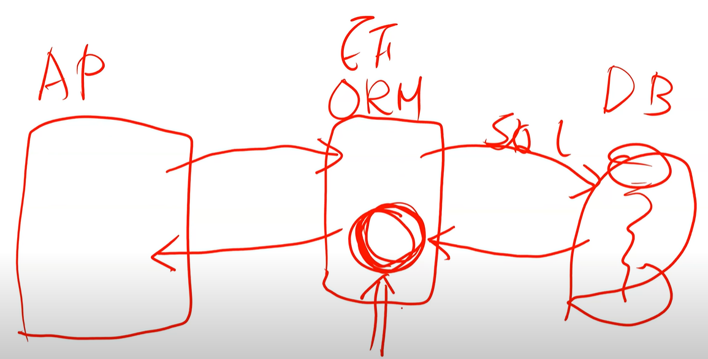

# 什麼是 EF 6???
[Entity Framework Core](https://learn.microsoft.com/zh-tw/ef/core/)

他是一個歷史非常悠久的框架， 2008 年就出來了 ，已經 16 年了
是一個很成熟的一套微軟出的 ORM 框架，這是 .net core 還沒出來時，.net framework 時代就已經存在的 ORM 框架

在那之前有一個  linq to sql ，但 2008 年之後，微軟全面朝 EF 發展

EF  可以支援各種不同的資料庫，包含 no-sql

ORM：Object relational mapping 物件跟關聯之間的對應表

基本上就是在幫我們進行「物件」、「關聯(table)」 之間的轉換
讓我們只需要專心操作物件(寫c#)本身，即可進行資料面的操作

最核心的價值就是這：它讓我們用物件導向的思維，處理資料庫的內容
也就是說，EF 幫我們把我們要操作 DB 的那些所有行為進行抽象化
他把 database 封裝成 物件的樣態，讓我們可以完全不用理解 SQL 語法、不用知道資料庫的存在，純粹靠著 C# 的物件，就能完成資料庫資料的操作

所以當我們都用這個方式操作資料，就會發現會變得非常簡單，直覺，開發速度快 程式程式


# EF 缺點

很難去微調  新增修改刪除的 sql 語法，建議不要調他

效能不好?
保哥表示
他從 2008 年開始，所有專案都是用 EF，包含幾個大型專案，同時上線人數五到十萬人，也從來沒有掛掉過

等等會提到效能調教技巧

# EF core

- 2016年，ef6 全部打掉重練
- .net core 出來的新架構
- 據說 .net core 1 的時候， EF core 超級難用
- 一直到現在 .net 8 的時代，已經進步到跟 ef 6 差不多 
- 現在大部分的 ef core 的 api 已經跟舊時代的 ef6 一模一樣!!!
- 支援兩種開發模式，db first 、 code first ，而對於初學者來說，建議使用 db first 

- 搭配 visual studio 的工具  efpower tool，幾乎可以完全不用寫 DBContext 相關的語法 


# 關於 ORM
1. 透過物件導向思維來管理關聯式資料
2. 將結構化的關聯資料對應成物件導向模型
3. 將物件資料對應成關聯資料


# 示範 EF Core

兩大重點

1. db first 開發
2. 搭配 ef core power tool 延伸模組，基本上可以不用維護 ORM 的 code

# 關於 ef core power tool 

context 要跟多少 table 有關連
屬性名稱代表，要用這個名稱存取 DB
綁定的強行別中，DB 有多少欄位，就代表這個型別會有多少屬性

而屬性名稱該怎麼對應到 DB 的欄位名稱？
全部都會是在 onmodelcreating 方法去定義


# 關於 query 的資料沒有存在 log

ef 傳入參數，那個參數不會顯示在 log 中，原因是避免機敏資訊被寫在 log 之中

如果真的需要在 log 顯示的話
必須加上
```c#
options.EnableSensitiveDataLogging();
```

# 比對日期要注意的事情
```csharp
d.StartDate.Date == DateTime.Parse("2015-03-21");

//重點是：d.StartDate`.Date`

```

# 基礎的 ef core 資料操作



當透過 ef 查詢資料的時候，EF 會快取一份資料在他身上
EF 吐給AP 的是一個副本，而正本存在 EF 身上

然後我們可以去更改副本的內容之後，執行 context.SaveChangesAsync

這個動作，EF 會比對 副本跟正本的差異，最後再轉變成 update set 等 sql 語法

因為有正副本，所以比較耗記憶體
因為 EF 預設你從他身上拿出來的資料，是有機會寫回去的

這個機制叫做［變更追蹤］

一個很簡單的效能調教是，取資料之後，對取出來的資料加上 `.AsNoTracking()`

```C#
      public async Task<ActionResult<IEnumerable<Course>>> GetCourses()
      {
          return await _context.Courses.AsNoTracking().ToListAsync();
      }
```

# 用模板新增的 crud

update 的code 寫得很糟

```csharp
[HttpPut("{id}")]
      public async Task<IActionResult> PutCourse(int id, Course course)
      {
        if (id != course.CourseId)
        {
            return BadRequest();
        }
        // 這段意思是
        // 把 course 透過 entry ，attach 到 context ，並且改變狀態變成 modified
        // ef 只要狀態被修改，就會自動把資料產出 update set where 的語法更改狀態
        // 這代表資料表內的每一筆資料、每一筆欄位都會被更新
        _context.Entry(course).State = EntityState.Modified;

        // 一樣的寫法還有這個
        _context.Attach(course);
        _context.Entry(course).State = EntityState.Modified;

        //以及這個
        _context.Update(course);


        // 意思完全一樣

        try
        {
            await _context.SaveChangesAsync();
        }
        catch (DbUpdateConcurrencyException)
        {
            if (!CourseExists(id))
            {
                return NotFound();
            }
            else
            {
                throw;
            }
        }

        return NoContent();
      }
```


正確的寫法應該是這樣，先把資料撈出來，修改部分資料後，儲存

```C#
[HttpPut("{id}")]
public async Task<IActionResult> PutCourse(int id, CourseUpdateParameter course)
{
    var data = await _context.Courses.FindAsync(id);

    if (data == null) 
    {
        return NotFound();
    }
    
    data.Title = course.Title;
    data.Credits = course.Credits;

    await _context.SaveChangesAsync();
}
```


# community 導入 EF 步驟

1. ef power tool ，到 repository 右鍵，反向工程
2. 確認 csproj 有沒有新增 nuget 套件
3. 新增DI注入

```csharp
services.AddScoped(sp =>
    {
        var databaseConnection = sp.GetRequiredService<IOptions<DatabaseConnectionOptions>>();
        var housePriceConnection = databaseConnection.Value.HousePrice;
        
        housePriceConnection += ";TrustServerCertificate=True;"; // 因為 EA 給的連線字串沒這句，自己補上

        var option = new DbContextOptionsBuilder<HousePriceContext>().UseSqlServer(housePriceConnection).Options;
        return new HousePriceContext(option);
    });

```

4. 在 Repository 注入 context
```c#

private readonly HousePriceContext _context;

public MyRepository(HousePriceContext context)
  {
      _context = context;
  }
```