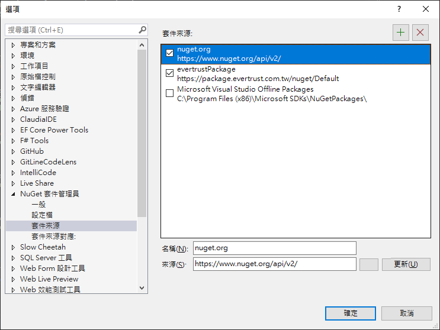
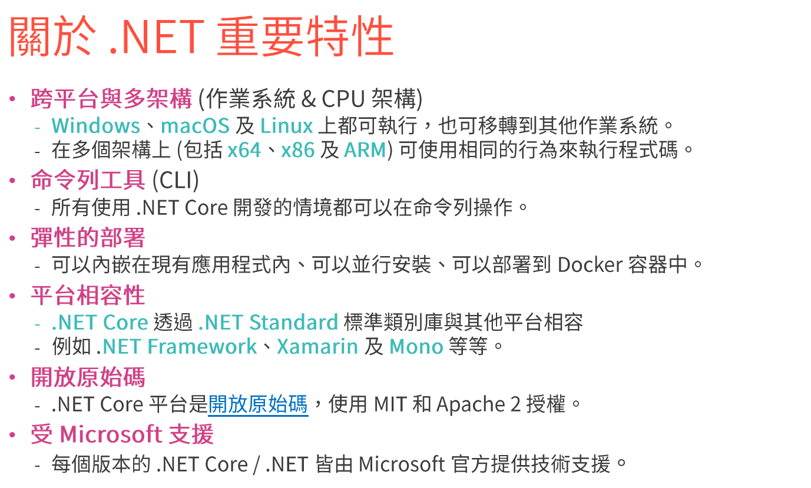

# .net 生態系介紹

1. 桌面應用  網站 行動裝置  api 遊戲 IOT AI 
2. 2015 開始  .net 變成開源的一個框架


# .net 三種實作
1. .net Framework
2. .NET Core/ .Net 5


.net framework 跟 .net core 是兩代不同的產品
所有底層全部都是重寫的，所有 code 都是重新寫過，沒有沿用舊的 code 重寫

.net core 的 base class library 雖然是全新的
不過這些 library 有 95% 以上 ，跟 .net framework 是完全相容的

用法一模一樣，參數一模一樣，有些連命名空間都一樣
這使得要把 .net framework 升級到 .net core 的門檻大大的降低


> 微軟做出這樣的改寫，目的是為了上雲


3. Xamarin => .net MAUI(毛衣)

xamarin 原本是個開源社群，被微軟買走了，微軟買走三四年後，微軟把這名字改掉，叫做毛衣

用這種技術開發出來的應用程式可以開發在 mac os android ios windows


# .net 發行週期

.net 6 開始，微軟發布一個政策

所有大版本，只要是雙號都是屬於`長期支援版`：三年
只要是單數號都是屬於`標準支援版`：一年半

也就是說，.net 6 到 2024 年底就不支援
.net7 則是到今年五月就已經不知元


到期之後就不會再支援，不對阿，微軟從來沒有支援我開發阿，我開發的 code 都是我想辦法從摳拍樂問出來的阿

所謂的不再支援代表微軟不再進行安全性更新
企業其實需要這種東西，底層如果有任何已知漏洞，是需要及時處理的
有官方的支援可以說是非常重要


支援三年，其實是一種資源配置，如果支援太久的話，要養一批人一直維護
而且對於商業公司來說，一直出新的就可以一直賣配套工具


# .net Standard

.net core 剛推出的時候，為了能騙微軟的客戶升級到 1.0 (很難用)
於是做了一個設計： .net standard
這是一個類別庫架構 

這個架構最主要的目的是
可以寫一份類別庫的專案，這個專案可同時給 .net core 專案、.net framework 專案使用

 .net standard 的架構訂出來之後，微軟訂出一個政策
 我們的 api 只要寫進 .net core 的任何版本，例如說 1.0 版
 那麼到下一版 1.1  甚至 2.0 
 api 是不會移掉的
 就算未來沒在用
api 也會一直留存

## 結論:
1. 只要出現過的 API ，絕對不會改變，即便現在是 .net 8 
.net 1 的 api 也一定可以使用


2. .net 5 開始，微軟決定不再同時支援 .net framework 跟 .net core，同時也把 core 字拿掉

而在現在 .net ， 只有在 asp.net core 會看到

換句話說
asp.net core 5   等同於 .net 5  
asp.net core 6   等同於 .net 7  
asp.net core 8   等同於 .net 8  

1. .net 5 之後就沒有 core 了，同時也已經沒有 .net standard 專案可以使用，這也代表 .net 5 之後，正是放棄 .net framework


# 關於升級

.net 6 之後，幾乎都可以無痛升級，會有一個升級小幫手可以使用
保哥一律建議，永遠升到最新版
不用擔心什麼 7 只有一年半，企業才不會選這種版本

微軟自家系統，全部都是用最新版
要是有問題，他們早就發現了

# .net 升級小幫手

只要是 web 的框架，從 framework to core 是不可能的
因為 System.Web 這個命名空間已經不在 .net core 出現

所以只要用到 sysetem.web 以下所有類別，已經換成別的，要手動改


升級 .net 版本事小，比較麻煩的是 nuget 套件的升級，因為套件提供的 api 有機會有破壞性更變

所以事實上，也是有可能採用，升級 .net 版本，但使用舊版 nuget 套件的可能性

# .net framerok 到底支援到什麼時候？

.net framework 本身是 windows 的核心元件，代表 windows 存在的一天就會有 .net Framework
所以，除非 windows 作業系統也被微軟捨棄，否則 .net framework 一定會活著


# BCL  基礎類別庫
BCL 類別幾千個，整個加起來六萬多個 api 可以 Call
.net 8 目前跟 .net framework 並駕齊驅

# .net Standard

.net standard 不包含實作，只有介面
不同平台被要求依定要實作 standard 的所有 apis 

.net 5 開始就沒這東西
表示 .net 5 開始的 class library，不會再給 .net framework 使用
不過 .net 5 還是保有 .net standard 的特性，也就是向下相容


如果建立新專案時，選擇 .net standard 2.0 
代表這是希望能支援 .net core 2.1 以上版本，同時支援 f 4.6.2 以上版本

所以如果你看到一個類別庫是透過 .net standard 2.0 建立
那就代表這個類別庫可以支援到 .net 8 都沒問題

# nuget 套件快取目錄
```sh
dotnet nuget locals all -l
```

清除
```sh
dotnet nuget locals all -c
```


# 查詢 nuget 來源

```sh
dotnet nuget list source
```
```sh
dotnet nuget list source
已註冊的來源:
  1.  nuget.org [已啟用]
      https://api.nuget.org/v3/index.json
  2.  evertrustPackage [已啟用]
      https://package.evertrust.com.tw/nuget/Default
  3.  Microsoft Visual Studio Offline Packages [已啟用]
      C:\Program Files (x86)\Microsoft SDKs\NuGetPackages\
```


# 引入 nuget 來源的動作

## 全域管理 Nuget 套件


1. 到nuget 管理工具

2. 點選設定後的這個介面增加


這個檔案背後是在抓 nuget.json 檔案

檔案位置：
```sh
%AppData%\NuGet\NuGet.Config
```

雖然這樣就可以在本機取得不同來源的 nuget 套件，不過保哥建議：
一定要在專案本地放一個 nuget.config 檔案放進版控，不要改 global 的 Sourse 

## 比較好的做法：依據專案管理 nuget 套件
1. 手動新增 nuget.config 檔案到 .git 同層目錄
2. 或是 執行以下指令
```sh
dotnet new nuget.config
```

將可以得到下列內容

```xml
<?xml version="1.0" encoding="utf-8"?>
<configuration>
  <packageSources>
    <!--To inherit the global NuGet package sources remove the <clear/> line below -->
    <clear />
    <add key="nuget" value="https://api.nuget.org/v3/index.json" />
  </packageSources>
</configuration>
```


# 發布 nuget 套件動作

1. 建立一個類別庫

在 csproj 檔案加上版號

```xml
<Version>1.0.0<Version>
```
1. 對專案按右鍵，點選套件
2. 產生專案的 .nupkg 就是那個套件本身


升級套件的作法
- 改完類別庫後，把 <Version>1.0.0<Version> 改成 其他數字
- 再執行一次上方操作


# 關於 .net 的重要特性


1. 跨平台與多框架
2. 命令列工具
3. 彈性的部屬
4. 平台相容性
5. 開放原始碼
6. 微軟支援
   - 免費支援：github 發 issue
   - 付費支援：跟微軟購買技術支援時數，一個點數台幣八千八，如果回報的問題是 bug ，那微軟會退消費點數



# dotnet 的組成

1. runtime
2. libraries
3. 編譯器
4. host: 主機  跑  誰負責啟動 dotnet 的，誰就是 host


# dotnet run

`dotnet run` 指令包含  `dotnet restore` 、 `dotnet build`

