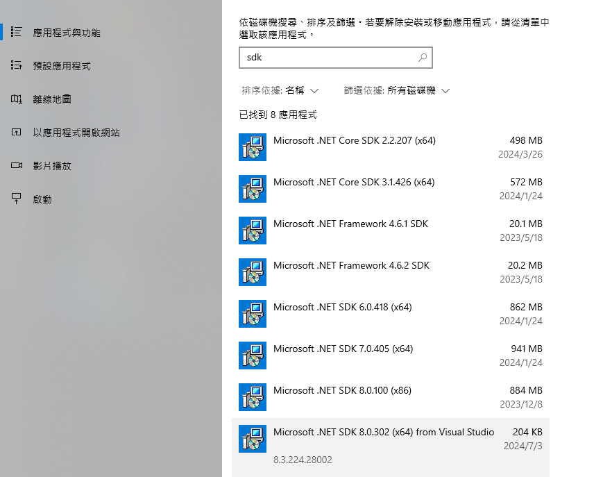
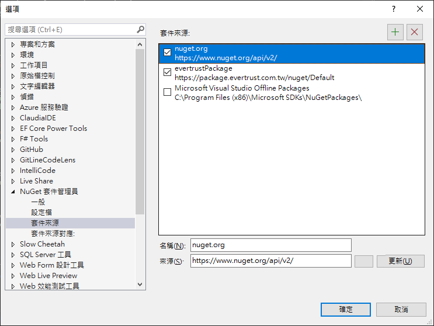

# .net Standard

.net core 剛推出的時候，為了能騙微軟的客戶升級到 1.0 (很難用)
於是做了一個設計： .net standard
這是一個類別庫架構 

這個架構最主要的目的是
可以寫一份類別庫的專案，這個專案可同時給 .net core 專案、.net framework 專案使用

 .net standard 的架構訂出來之後，微軟訂出一個政策
 我們的 api 只要寫進 .net core 的任何版本，例如說 1.0 版
 那麼到下一版 1.1  甚至 2.0 
 api 是不會移掉的
 就算未來沒在用
api 也會一直留存

結論:
只要出現過的 API ，絕對不會改變，即便現在是 .net 8 
.net 1 的 api 也一定可以使用


.net 5 開始，微軟決定不再同時支援 .net framework 跟 .net core
順便把產品名稱改了

.net 5 之後就沒有 core 了

# 不建議在 core 方案去共用 dll


# 發布 nuget 套件動作


csproj 檔案

```xml
<Version>1.0.0<Version>
```
1. 對專案按右鍵，點選套件
2. 產生專案的 .nupkg 就是那個套件本身


升級套件的作法
- 改完類別庫後，把 <Version>1.0.0<Version> 改成 其他數字
- 再執行一次上方操作


# 查詢 nuget 來源

```sh
dotnet nuget list source
```
```sh
dotnet nuget list source
已註冊的來源:
  1.  nuget.org [已啟用]
      https://api.nuget.org/v3/index.json
  2.  evertrustPackage [已啟用]
      https://package.evertrust.com.tw/nuget/Default
  3.  Microsoft Visual Studio Offline Packages [已啟用]
      C:\Program Files (x86)\Microsoft SDKs\NuGetPackages\
```


# 引入 nuget 來源的動作

## 全域管理 Nuget 套件


1. 到nuget 管理工具

2. 點選設定後的這個介面增加


這個檔案背後是在抓 nuget.json 檔案

檔案位置：
```sh
%AppData%\NuGet\NuGet.Config
```


一定要在專案本地放一個 nuget.config 檔案放進版控，不要改 global 的 Sourse 

## 比較好的做法：依據專案管理 nuget 套件
1. 手動新增 nuget.config 檔案到 .git 同層目錄
2. 或是 執行以下指令
```sh
dotnet new nuget.config
```

將可以得到下列內容

```sh
<?xml version="1.0" encoding="utf-8"?>
<configuration>
  <packageSources>
    <!--To inherit the global NuGet package sources remove the <clear/> line below -->
    <clear />
    <add key="nuget" value="https://api.nuget.org/v3/index.json" />
  </packageSources>
</configuration>
```


# dotnet 的組成

1. runtime
2. libraries
3. 編譯器
4. host: 主機  跑  誰負責啟動 dotnet 的，誰就是 host


# dotnet run

dotnet run 指令包含  dotnet restore 、 dotnet build

